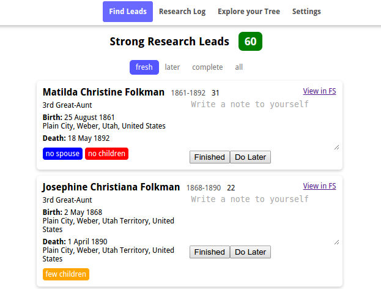
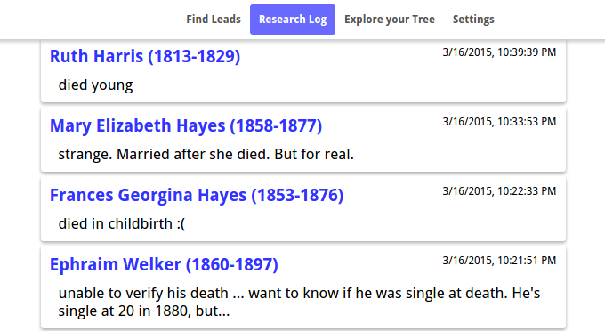
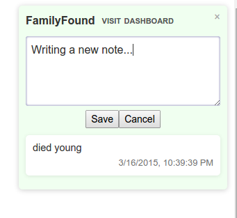

# FamilyFound

FamilyFound is a tool to help you get the most out of family history research.
It is aimed at tackling the following questions:

## Where do I even start?
Everywhere I look the work has been done! I spend all my time looking around,
and **sometimes** I get lucjy and find something interesting.

The FamilyFound lead finder will automatically search through your family tree
(including cousins) to find areas of your family history that still need some
research. You can then research these leads and mark them as "completed" or
"do later" for when you have extra help or more time.

## What was I doing last month (year) when I last did family history?
We all know the feeling. You're sure there was something important left to do,
and you thought you'd remmeber it....

FamilyFound helps you create a *research log* (just like the professionals)
with almost no effort. Make notes on people when you do research, or write
down tasks to complete later. These will be collected and available to you in
the research log on your familyfound dashboard.

## What have I accomplished so far?
(coming soon)

FamilyFound will automatically keep track of your progress on family hostroy
research, and construct an annotated research log. You can then see how many
people you've found, where your strengths lie, and what eareas of research you
still have to discover.

